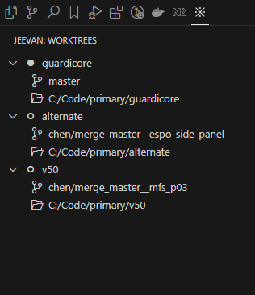

# Worktrees

**Smooth worktrees management**

Welcome to **Worktrees**, a VSCode extension that enhances Git worktree management directly within the editor. This extension provides an intuitive interface to view, navigate, and manage Git worktrees and branches in your repository.

## Features

- **Hierarchical View of Worktrees**: Visualize your Git worktrees and associated branches in a clean, hierarchical structure.
- **Copy to Clipboard**: Easily copy worktree paths and branch names using a convenient copy icon for each item.
- **Automatic Refresh**: Refresh the worktree list with a single click or automatically upon changes.

 

Screenshots of the extension in action:

## Requirements

This extension requires:
- **Git** to be installed and available in your system's PATH.  
- A VSCode workspace with an initialized Git repository.

### Optional Dependencies
- None at this time, but ensure Git is properly configured for your workspace.

## Extension Settings

The **Worktrees** extension does not add any new configuration settings for now. Future updates may introduce additional settings for customizing your experience.

## Known Issues

- On some systems, the worktree paths may not display properly if Git is not correctly configured.
- Currently, only the paths and branches of worktrees are shown; more advanced Git features might be added in future releases.

For more details, check out our [issue tracker](#).

## Release Notes

### 1.0.0

- Initial release with basic functionality:
  - Display worktrees and branches in a hierarchical view.
  - Copy worktree paths and branches to clipboard using dedicated icons.
  - Auto-refresh worktree list.

---

## For more information

- Learn more about Git worktrees: [Git Worktree Documentation](https://git-scm.com/docs/git-worktree)

  

**Enjoy!**
